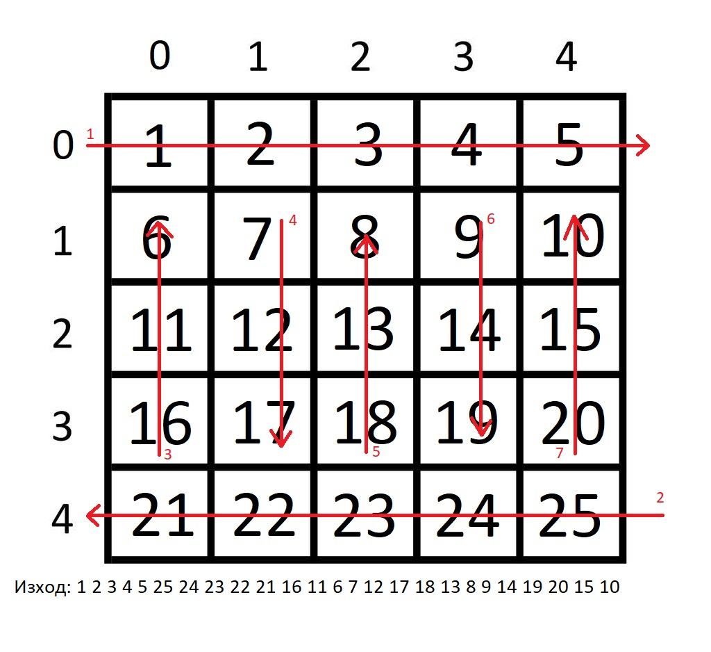

# Task 1
По дадена квадратна матрица, да се извведат елементите на матрицата по следния начин
<p align="center">

</p>

# Task 2
Да се напише функция, която по даден масив от цели числа ( и неговият размер ) и цяло число n, премахмва от масива всички срещания на даденото число. Ако има премахнати елементи, функцията връща true, в противен случай, ако елементът със стойност n не се среща в дадения масив, функцията връща false. Премахването на елемент от масив осъществете, като преместите всички елементи след избрания за изтриване с едно на ляво и намалите размера на масива с 1.

# Task 3 
Да се напише функция, която по даден масив от реални числа ( и неговият размер ), върща модата, медианата и средно аритметичото от числата в масива. Вие преценете кое иската да подавате като псевдоним и кое искате да върнете като стойност.

# Task 4
Да се напише фунцкия, която по даден символен низ, връща първия най-дълъг подниз, който не съдържа малки, главни букви или разтояния.
```
"8&*8[' ]\[768dfzf cvf7,.65*&Ads -0-['qew;e[769sdfs adf768; ;]'///[" -> "7,.65*&"
``` 