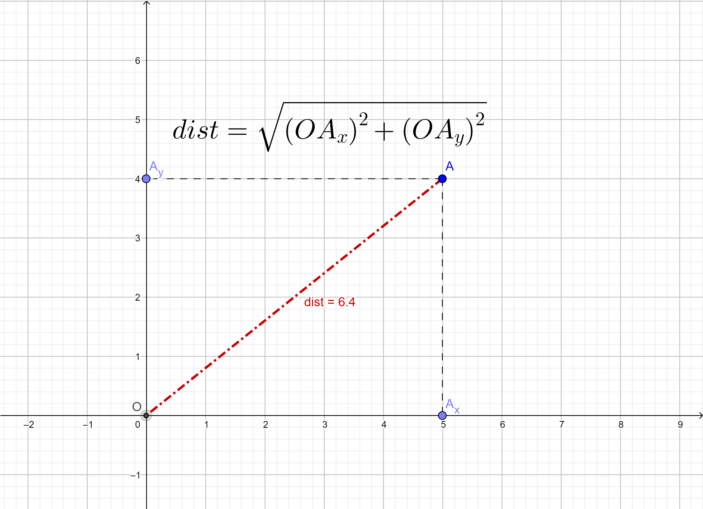
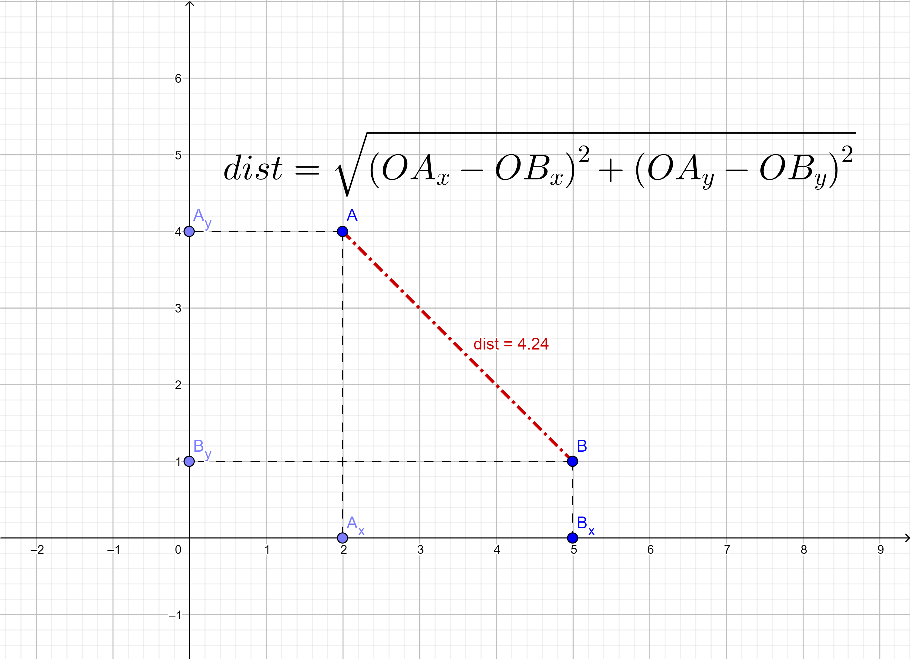
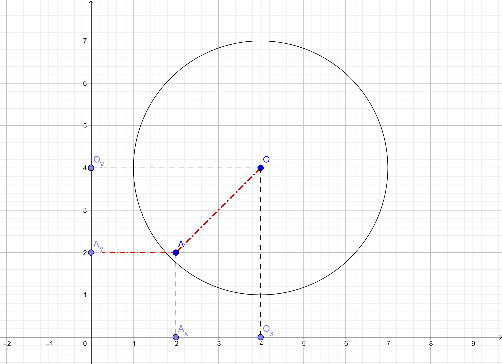
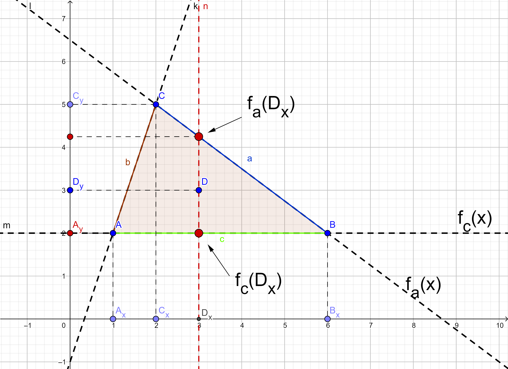

# Разтояние от центъра на координатната система до точка

## Разтоянието между точка и центъра на координатната система се изчислява просто чрез формулата на Питагор. Тук X и Y координатите на точката А играят ролята на двата катета на триъгълника OAAx(= OAAy).

# Точка лежаща в окръжност с център (0, 0)

## Дали дадена точка лежи в окръжност с център началото на координатната система зависи от това дали разтоянието й от центъра не е по-голямо от радиуса на окръжността. Когато разтоянието е по-малко от радиуса, тя лежи във окръжността. Ако разтоянието е колкото радиуса, точката лежи на окръжността. 

# Разтояние между две точки

## Разтоянието между две точки е общия случай на горния. Тук действа същия принцип за намиране на разтоянието. Този път дължината на катетите се взима като разтоянието между координатите на двете точки.

# Точка лежаща в проиволна окръжност

## Принципа дали дадена точка лежи в окръжност с произволен център е еквивалентен: Намирате разтоянието от дадената точка до ценъра на окръжността и сравнявате с радиуса.

# Точка лежаща в триъгълник

## Когато проверяваме дали точка лежи в даден триъгълник ( или какъвто и да е многоъгълник), има повече стъпки и по-голяма свобода при избора как ще достигнем до резултат. Първото задължително нещо е да намерим формулите на правите които образуват триъгълника. Това става елеметарно като създадем една система от две уравнения, замествайки координатите точките образуващи правата в общото уравнение за права: y = ax + b.  

## В примера на картинката ще намерим правата AC (y = fb(x)):

    

    2 = a + b 
    5 = 2a + b
    

    

     
    < = >
    

    

        a = 2 - b 
        -b = 1
    

    

     
    < = >
    

     

        a = 3 
        b = -1
    

## Следователно правата има фомула : y = fb(x) = 3x - 1
## Правата AB е константа ( y = fc(x) = 2 )
## По-същия начин намирме и правата BC
## Сега остава да раздробим триъгълника на по-малки триъгълници в които да имаме точно една функция за долна и точна една фунцкиза за горна. В нашия случай това са интервалите АxCx (горна функция правата AC, долна AB) и CxBx (горна функция правата BC, долна AB)
## Сега вече за дадена x-координата проверяваме дали тя е между стойностите на долната и горната функция на дадения интервал.

